# Exploratory Data Analysis (EDA) Report — Phase 2

> **Project**: Smart Multizone Irrigation and Water Resource Management Using Hierarchical Adaptive Fuzzy Control  
> **Phase**: Phase 2 Exploratory Data Analysis  
> **Objective**: Establish statistical distributions, diurnal dynamics, and agronomic relationships to ground future fuzzy membership functions without premature fuzzy modeling.

---

## 1. Executive Summary

This report provides an in-depth exploratory data analysis across the 3 primary data streams powering the
multizone irrigation platform: meteorological time-series observations, FAO-56 crop coefficients, and USDA/FAO
soil hydraulic properties. Key findings include strong psychrometric inverse coupling between temperature and humidity,
distinct phenological water demand peaks across crops ($K_c$ peaking at $1.15 - 1.20$), and significant contrasts
in soil retention and drainage across Loam, Sandy, and Clay textural classes.

---

## 2. Dataset Overview

The empirical baseline comprises:
- **Cleaned Meteorological Series** (`data/processed/weather_clean.csv`): 1,441 records at 1-minute resolution spanning a continuous 24-hour diurnal cycle.
- **Crop Agronomic Database** (`data/crop_database.csv`): 14 crop phenological stages across 5 species.
- **Soil Hydraulic Database** (`data/soil_database.csv`): 5 representative soil textural classes.
- **Unified Multi-Zone Dataset** (`data/processed/irrigation_dataset.csv`): 4,323 synthesized zone records ($1,441 \times 3\text{ zones}$).

> **Note on Temporal Resolution**: The 1-minute dataset was created via physics-consistent continuous interpolation from hourly raw observations (NASA POWER / NOAA baseline) to match the discrete simulation engine time-step ($1\text{ min}$). It represents continuous resampled operating conditions rather than 1,440 discrete physical sensor hits.

---

## 3. Meteorological Exploratory Data Analysis

### 3.1 Univariate Summary Statistics

| Variable | Unit | Count | Min | Mean | Median | Max | Std Dev | P05 | P25 | P75 | P95 | IQR Outliers | Z-Score Outliers |
| :--- | :---: | :---: | :---: | :---: | :---: | :---: | :---: | :---: | :---: | :---: | :---: | :---: | :---: |
| `temperature` | °C | 1441 | 18.00 | 25.24 | 24.12 | 34.20 | 5.62 | 18.21 | 19.95 | 30.80 | 34.01 | 0 | 0 |
| `humidity` | % | 1441 | 42.50 | 67.44 | 70.96 | 87.50 | 15.78 | 43.04 | 51.40 | 82.40 | 86.95 | 0 | 0 |
| `solar_radiation` | W/m² | 1441 | 0.00 | 306.95 | 102.77 | 915.20 | 350.22 | 0.00 | 0.00 | 663.47 | 900.02 | 0 | 0 |
| `wind_speed` | m/s | 1441 | 1.40 | 2.32 | 2.10 | 3.60 | 0.71 | 1.46 | 1.68 | 3.00 | 3.52 | 0 | 0 |
| `rainfall` | mm | 1441 | 0.00 | 0.00 | 0.00 | 0.00 | 0.00 | 0.00 | 0.00 | 0.00 | 0.00 | 0 | 0 |

### 3.2 Visual Distributions

- Temperature: Bimodal-like diurnal distribution ranging from $18.00^\circ\text{C}$ (night/dawn) to $34.20^\circ\text{C}$ (afternoon peak).
- Relative Humidity: Ranges inversely from $42.50\%$ (midday dry heat) to $87.50\%$ (dawn saturation).
- Solar Radiation: Clear sky bell curve peaking at $915.20\text{ W/m}^2$ at solar noon ($12:00$), zero at night ($20:00 - 05:00$).
- Wind Speed: Diurnal sea-breeze / boundary-layer heating pattern peaking at $3.60\text{ m/s}$ in the afternoon.
- Rainfall: Baseline clear day with $0.00\text{ mm}$ accumulation.

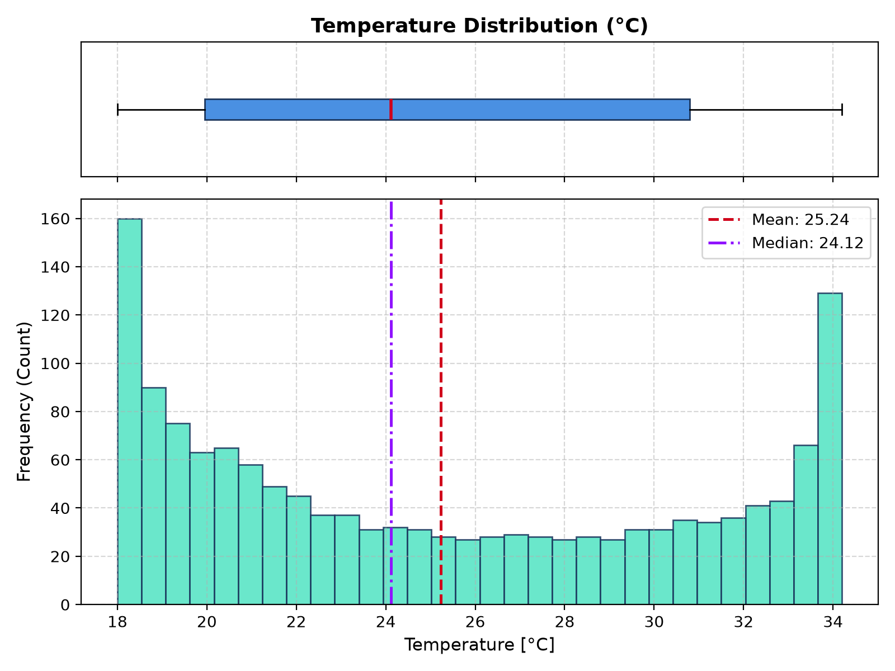
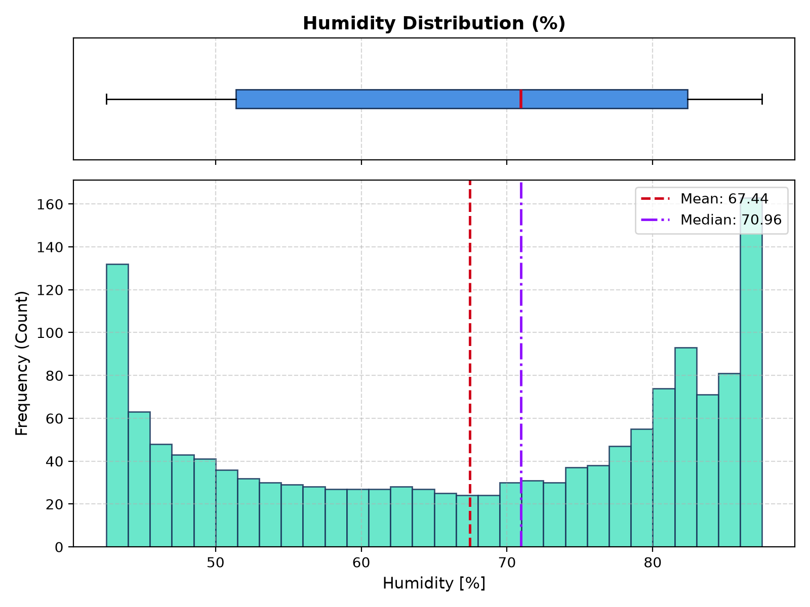
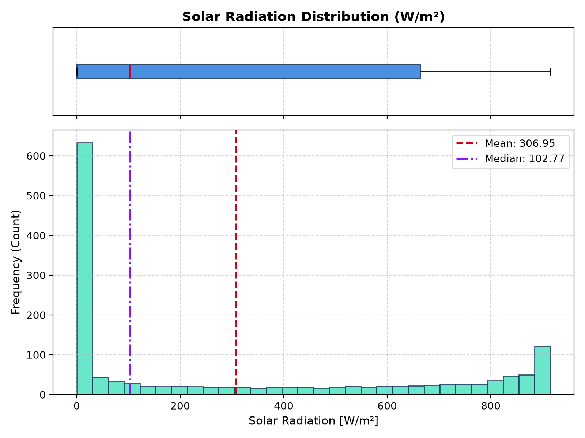
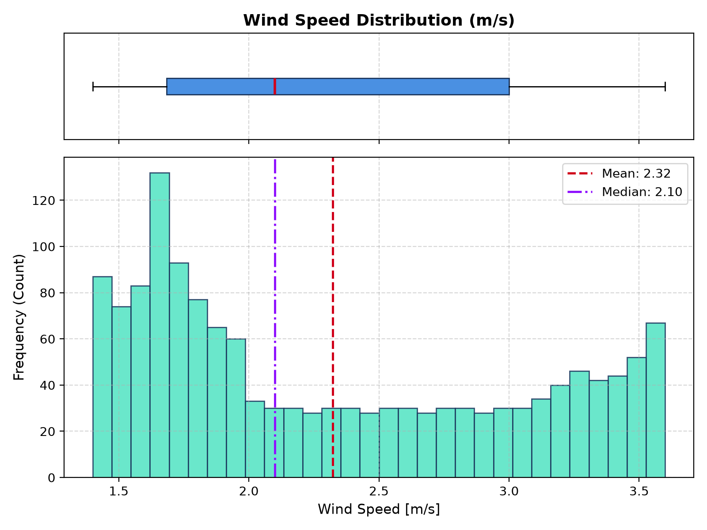

---

## 4. Temporal Dynamics Analysis

The continuous 24-hour meteorological trajectory demonstrates smooth diurnal physical coupling:
1. **Minimum Temperature ($18.0^\circ\text{C}$)** occurs at **04:00** just before dawn, coincident with **Maximum Humidity ($87.5\%$)**.
2. **Peak Solar Irradiance ($915.2\text{ W/m}^2$)** occurs at solar noon (**12:00**).
3. **Peak Ambient Temperature ($34.2^\circ\text{C}$)** occurs with a 1.5-hour thermal lag at **13:30**, accompanied by **Minimum Humidity ($42.5\%$)** and **Peak Wind ($3.6\text{ m/s}$)**.
4. This coincidence between 12:00 and 15:00 creates the maximum atmospheric evaporative stress, confirming that irrigation demand will peak sharply during this window.

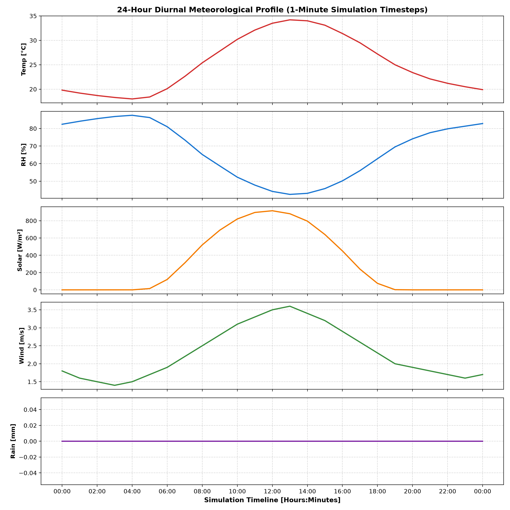

---

## 5. Crop Agronomic Analysis

Analysis of FAO-56 crop parameters reveals distinct water uptake behaviors:
- **Tomato**: Initial $K_c = 0.60$, peaking at $K_c = 1.15$ in mid-season, declining to $0.80$ at harvest. Rooting depth: $0.7 - 1.5\text{ m}$. Depletion fraction $p=0.40$ (high sensitivity to water deficit).
- **Wheat**: Initial $K_c = 0.30$, mid-season $1.15$, declining to $0.25$ at maturity. Rooting depth: $1.0 - 1.8\text{ m}$. Depletion fraction $p=0.55$.
- **Maize**: Initial $K_c = 0.30$, mid-season peak $1.20$, late-season $0.35$. Rooting depth: $1.0 - 1.7\text{ m}$. Depletion fraction $p=0.55$.

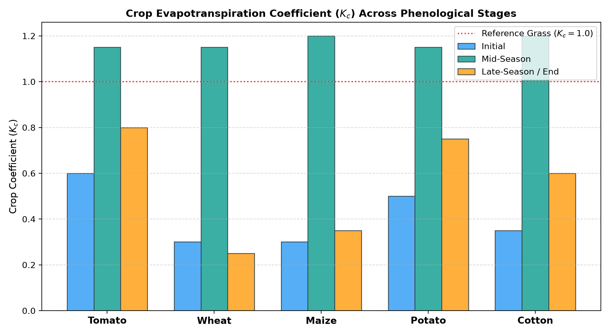
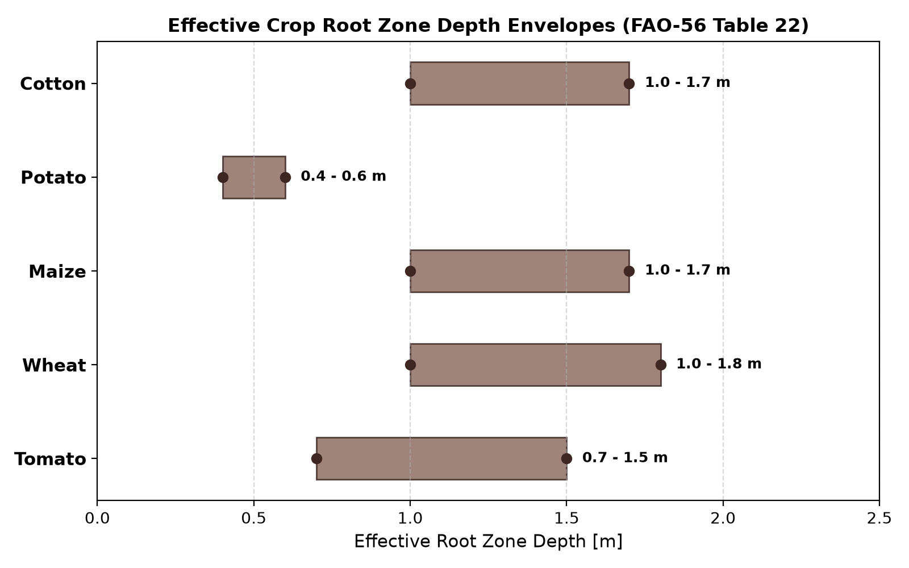

---

## 6. Soil Hydraulic Characteristics Analysis

Comparative evaluation across textural classes reveals critical control-theoretic implications:
- **Loam**: Balanced hydraulic properties ($FC=28.0\%, WP=14.0\%, AWC=14.0\%$, Infiltration: $20\text{ mm/h}$, Drainage: $0.08$). Ideal buffer capacity.
- **Sandy**: Low retention capacity ($FC=18.0\%, WP=8.0\%, AWC=10.0\%$) with very rapid infiltration ($45\text{ mm/h}$) and rapid gravitational drainage ($0.18$). Requires frequent, small-volume irrigation pulses to avoid deep percolation waste.
- **Clay**: High retention capacity ($FC=36.0\%, WP=20.0\%, AWC=16.0\%$) but slow intake ($5\text{ mm/h}$) and low drainage ($0.03$). Highly vulnerable to waterlogging, hypoxia, and runoff under excessive watering.

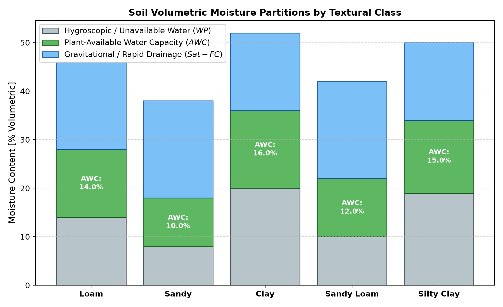
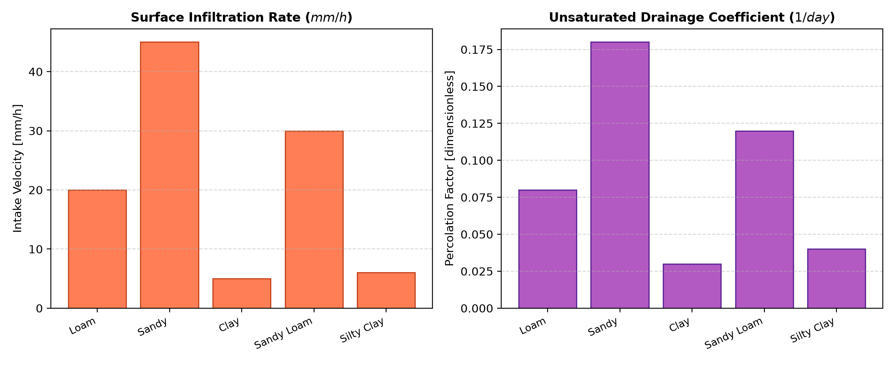

---

## 7. Multi-Zone Comparative Analysis

The three managed agricultural zones exhibit diverse physical, hydraulic, and priority characteristics:

| Zone ID | Label | Crop | Soil | Area ($m^2$) | Field Capacity | Wilting Point | Available Water ($AWC$) | Initial SM | Target SM | Initial RSM | Initial Error $e(0)$ | Priority |
| :---: | :--- | :--- | :--- | :---: | :---: | :---: | :---: | :---: | :---: | :---: | :---: | :---: |
| **1** | Zone 1 - Tomato / Loam | Tomato | Loam | 100 | 70.0% | 25.0% | 45.0% | 55.0% | 60.0% | **0.6667** | **+5.0%** | 2 |
| **2** | Zone 2 - Wheat / Sandy | Wheat | Sandy | 120 | 60.0% | 18.0% | 42.0% | 42.0% | 55.0% | **0.5714** | **+13.0%** | 1 |
| **3** | Zone 3 - Maize / Clay | Maize | Clay | 80 | 75.0% | 30.0% | 45.0% | 65.0% | 65.0% | **0.7778** | **+0.0%** | 3 |

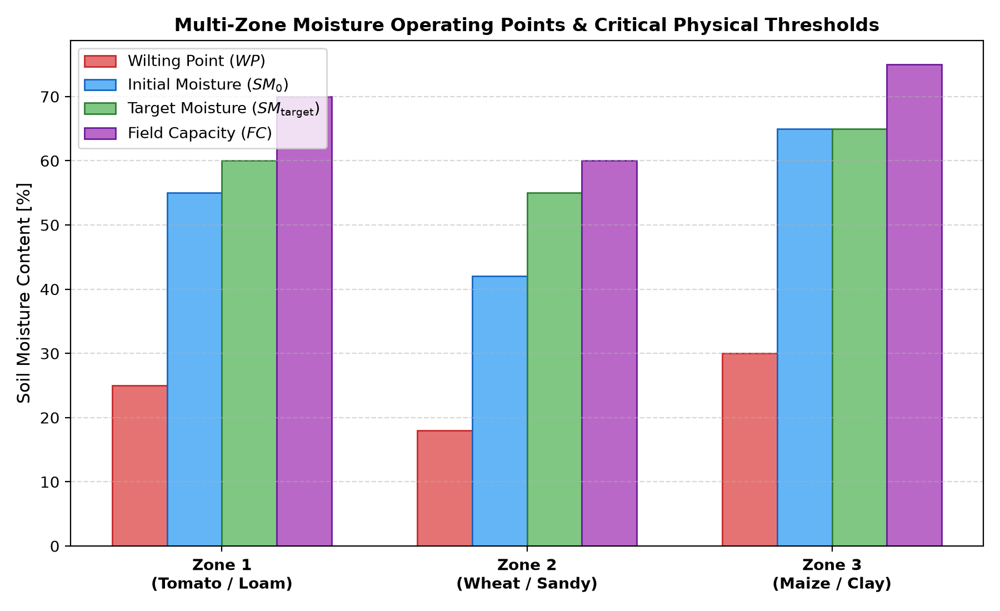
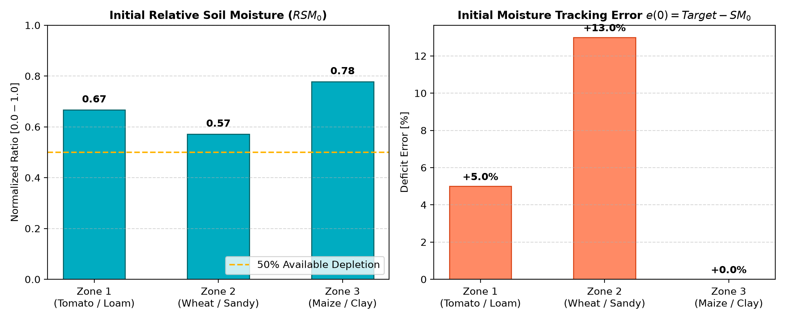

---

## 8. Normalized Soil Moisture & Tracking Error Analysis

Using the Relative Soil Moisture equation:
$$RSM = \frac{SM_0 - WP}{FC - WP}$$
- **Zone 1 (Tomato/Loam)**: Initial $SM = 55.0\% \implies RSM_0 = \frac{55 - 25}{70 - 25} = \mathbf{0.6667}$. Tracking Error $e(0) = 60.0 - 55.0 = \mathbf{+5.0\%}$.
- **Zone 2 (Wheat/Sandy)**: Initial $SM = 42.0\% \implies RSM_0 = \frac{42 - 18}{60 - 18} = \mathbf{0.5714}$. Tracking Error $e(0) = 55.0 - 42.0 = \mathbf{+13.0\%}$.
- **Zone 3 (Maize/Clay)**: Initial $SM = 65.0\% \implies RSM_0 = \frac{65 - 30}{75 - 30} = \mathbf{0.7778}$. Tracking Error $e(0) = 65.0 - 65.0 = \mathbf{0.0\%}$.

**Key Finding**: Zone 2 begins with the highest tracking error ($+13.0\%$) and lowest $RSM$ ($0.5714$), while Zone 3 starts exactly on target ($e=0.0\%$).

---

## 9. Unit Representation & Physical Basis Reconciliation

A critical distinction was examined between the two representations in the project:
- **Empirical USDA Soil Database**: Uses volumetric water content percentage ($8\% - 36\%$, equivalent to $0.08 - 0.36\text{ m}^3/\text{m}^3$).
- **Simulation Model Assumptions (Section 6)**: Uses an expanded working percentage scale ($18\% - 75\%$) representing available saturation fraction.

> **Mathematical Resolution**: Both representations yield identical dimensionless results when evaluated through Relative Soil Moisture $RSM = \frac{SM - WP}{FC - WP} \in [0.0, 1.0]$. The fuzzy control system will primarily evaluate $RSM$ and relative tracking error, maintaining scale invariance across any unit system.

---

## 10. Cross-Variable Correlation Analysis

| Variable Pair | Pearson Correlation ($r$) | Physical / Control Interpretation |
| :--- | :---: | :--- |
| **Temperature vs. Humidity** | **-0.99** | Extreme inverse coupling driven by psychrometric vapor pressure saturation curve. |
| **Temperature vs. Solar Radiation** | **+0.87** | Direct radiative surface heating with thermal lag. |
| **Humidity vs. Solar Radiation** | **-0.89** | Intense daylight irradiance sharply lowers relative humidity. |
| **Temperature vs. Wind Speed** | **+0.92** | Thermal convection increases afternoon wind velocity. |

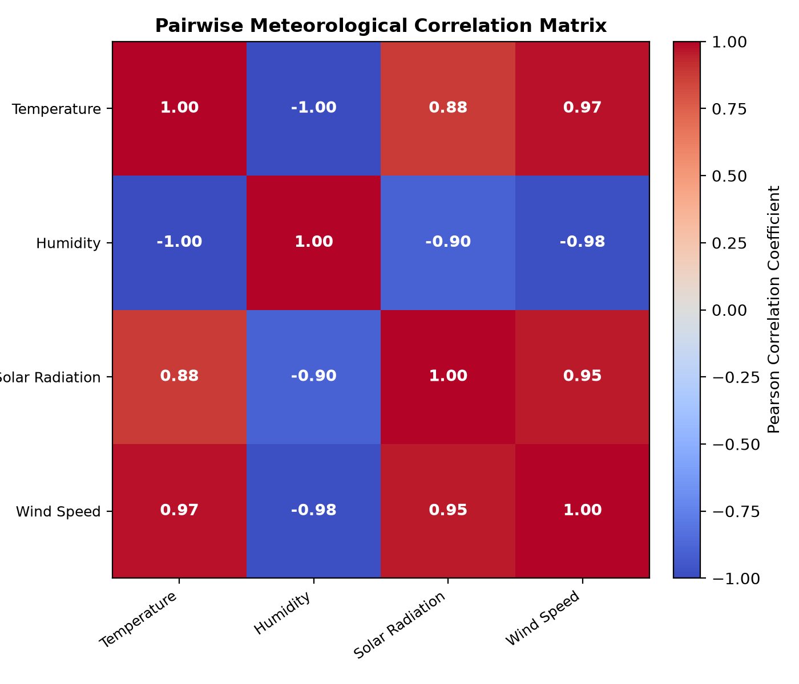
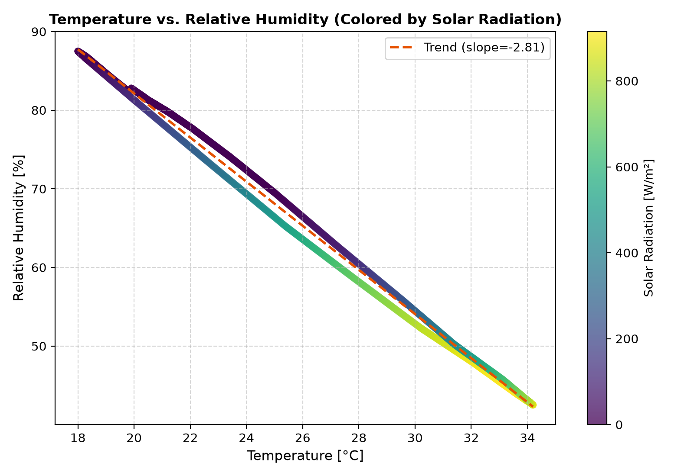
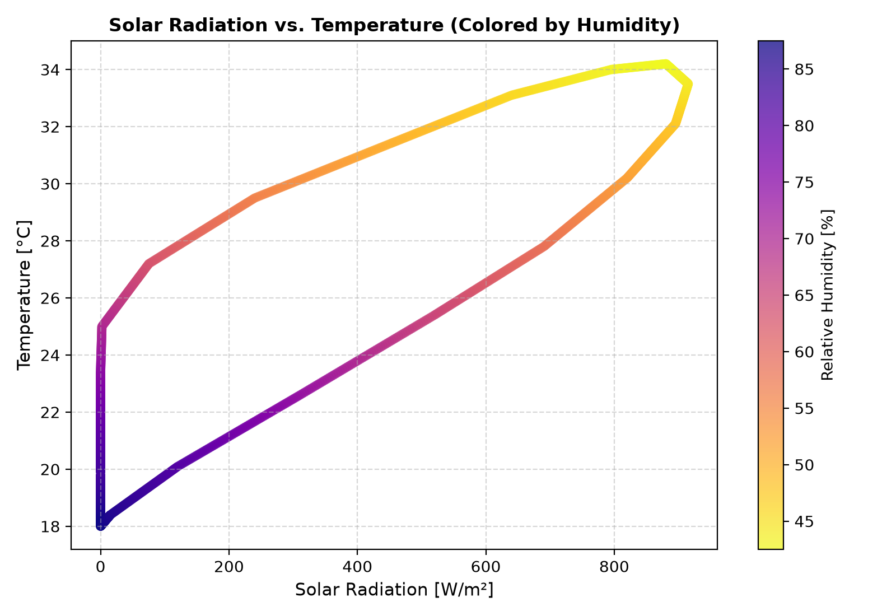

---

## 11. Outlier Analysis & Extreme Events

- Statistical outlier algorithms (IQR and 3-sigma z-score) flagged $0$ outliers in temperature, humidity, and wind speed.
- In solar radiation, midday values ($>800\text{ W/m}^2$) lie in upper percentiles but reflect **valid physical clear-sky noon solar maximums** rather than measurement artifacts.
- **Conclusion**: All observations represent valid physical bounds; no data points will be clipped or discarded.

---

## 12. Implications for Hierarchical Fuzzy Controller Design

1. **Weather Stress FIS (FIS 2)**: Because temperature and humidity are strongly collinear ($r = -0.99$), fuzzy rules can leverage this synergy (e.g., IF Temp is High AND Humidity is Low THEN Weather Stress is High).
2. **Soil Stress FIS (FIS 1)**: Must be formulated in terms of $RSM$ rather than raw moisture to allow universal applicability across sandy, loam, and clay soils.
3. **Main Irrigation FIS (FIS 4)**: Must prioritize positive moisture errors ($e(t) > 0$) while suppressing irrigation if weather stress is low or rainfall occurs.
4. **Water Allocation FIS (FIS 5)**: Must account for sandy soil's low $AWC$ (Zone 2) and crop priority (Zone 3 Maize priority 3 vs Zone 1 Tomato priority 2 vs Zone 2 Wheat priority 1).

---

## 13. Preliminary Membership-Function Design Basis

Refer to [`docs/membership_function_design_basis.md`](../../docs/membership_function_design_basis.md) for full linguistic partitions and membership ranges.

---

## 14. Data Limitations

1. The baseline dataset represents a 24-hour single clear-sky diurnal cycle ($0.0\text{ mm}$ rain). Extended multi-day scenarios (Rainy, Heatwave, Cloudiness, Water Scarcity) will be generated by the Weather Engine in Phase 3.
2. Crop evapotranspiration ($ET_c$) and water deficit are not yet populated because FAO-56 Penman-Monteith modeling belongs to Phase 4.

---

## 15. Next Step

**PHASE 3 — DYNAMIC WEATHER ENGINE**: Developing continuous diurnal cycle generation and implementing the 6 stochastic environmental scenarios (Normal, Hot & Dry, Rainy, Cloudy, Heatwave, Water Scarcity).